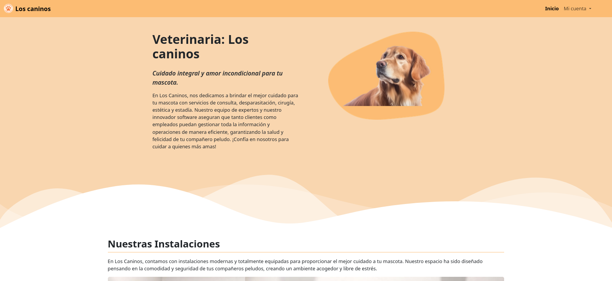
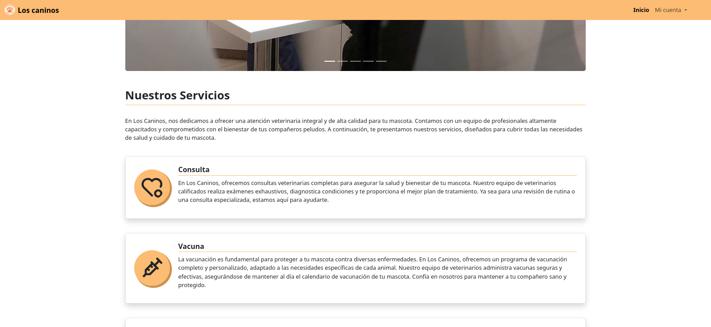
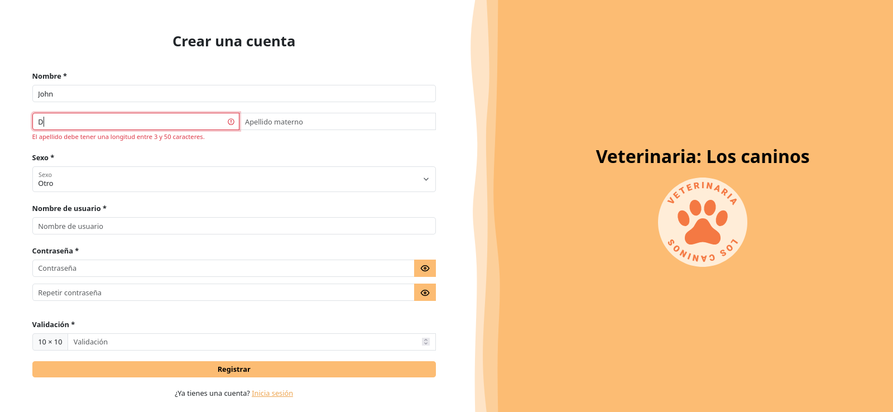
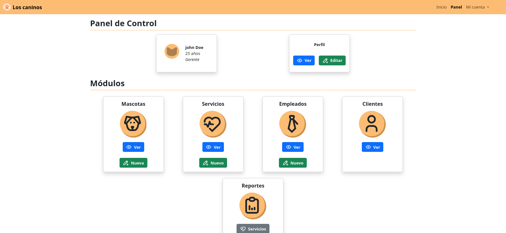
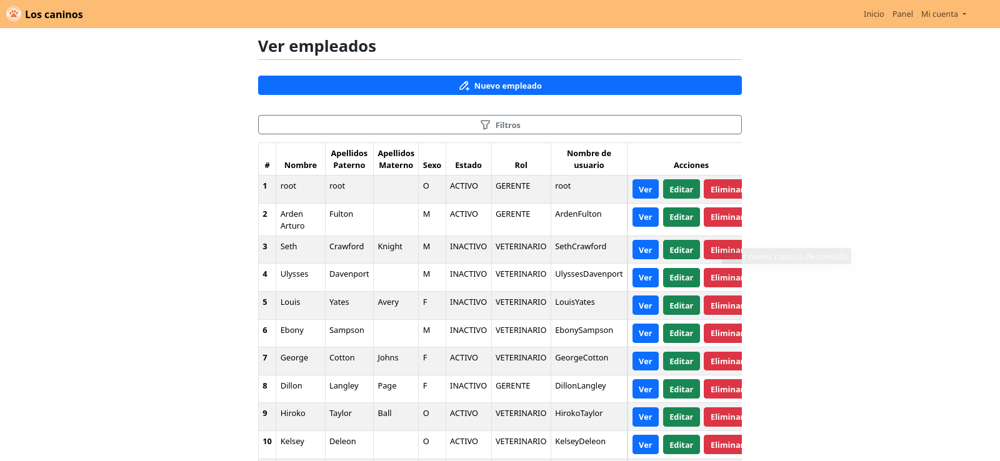
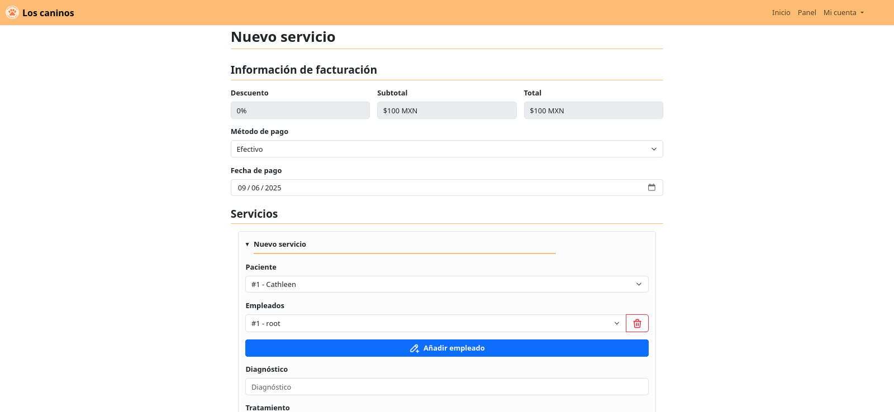
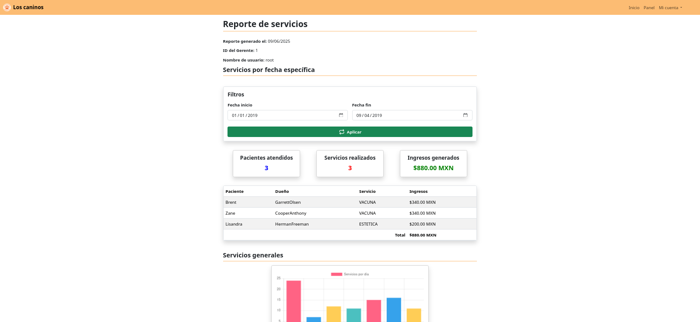
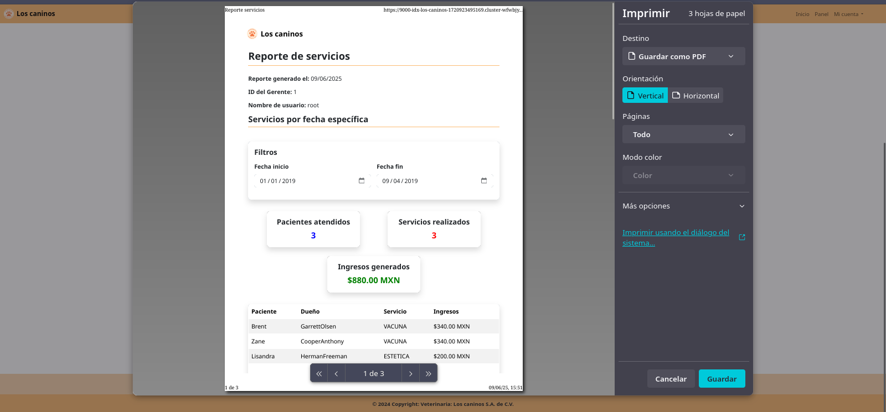

<h1 align="center">
  
   
  Veterinaria: Los caninos
   
   
</h1>

  
  
  
  
  

[`los-caninos`](https://github.com/InterdataUTJ/los-caninos) is an administrative portal Custom-developed for the `Veteriaria: Los caninos` This project features sections for managing employees, clients, pets, and services performed. Additionally, it allows the manager to create reports with information about pets and services, and also allows reports to be printed in PDF format.

The platform is built entirely using Vanilla PHP along with [Chart.js](https://www.chartjs.org/) to display charts in the reports section.

## Screenshots 📲

## Documentation 📚

You can access the project documentation from the following links.

#### Table of Contents

- [URLs](./docs/URLs.md)
- [Navigation Map](https://interdatautj.github.io/los-caninos/)

## License 🚨

This project is published under the [**GPL v3**](https://www.gnu.org/licenses/gpl-3.0) license.

